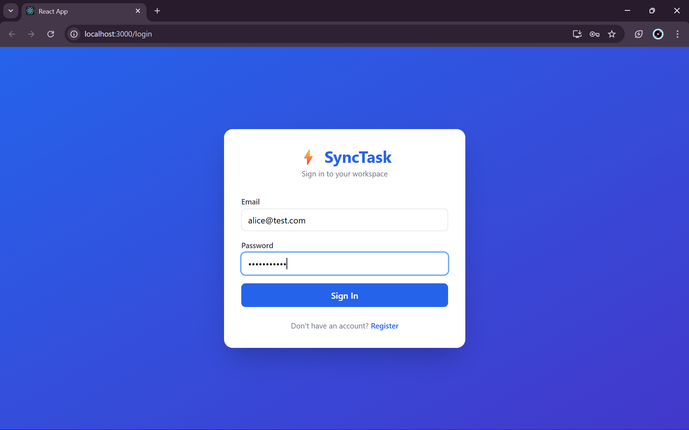
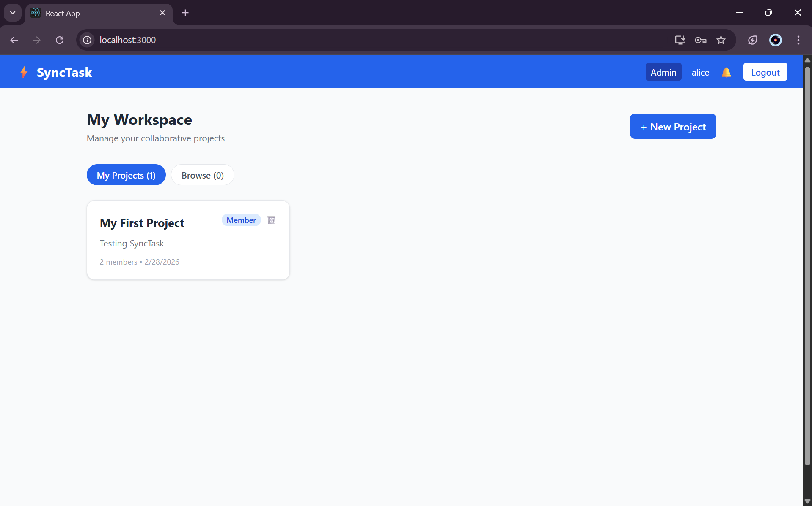
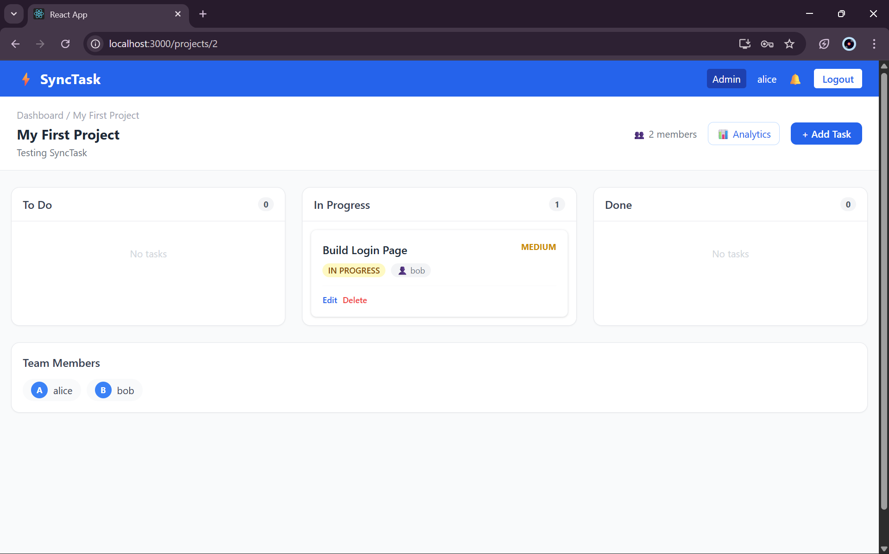
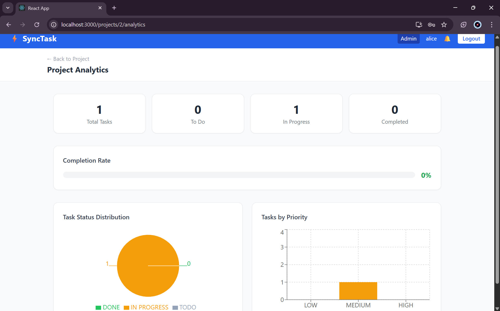

# ⚡ SyncTask - Distributed Collaborative Task Manager

A full-stack real-time collaborative task management system built with FastAPI, React, PostgreSQL, and WebSockets.

## 🚀 Features

- 🔐 JWT Authentication (Register/Login)
- 👥 Role-based access control (Admin/Member)
- 📋 Kanban board (To Do / In Progress / Done)
- ⚡ Real-time updates via WebSockets
- 🔔 Live notification bell
- 📊 Analytics dashboard with charts
- 🐳 Docker support

## 🛠️ Tech Stack

### Backend
- Python 3.10
- FastAPI
- PostgreSQL
- SQLAlchemy
- WebSockets
- JWT Authentication

### Frontend
- React 18
- Tailwind CSS
- Recharts
- Axios
- React Router

## 📦 Installation

### Prerequisites
- Python 3.10+
- Node.js 18+
- PostgreSQL

### Backend Setup
```bash
cd backend
python -m venv venv
venv\Scripts\activate
pip install -r requirements.txt
uvicorn app.main:app --reload --port 8000
```

### Frontend Setup
```bash
cd frontend
npm install
npm start
```

### Docker Setup
```bash
docker-compose up
```

## 🌐 Usage

- Frontend: http://localhost:3000
- Backend API: http://localhost:8000
- API Docs: http://localhost:8000/docs

## 📸 Screenshots

### Login Page


### Dashboard


### Kanban Board


### Analytics


## 👨‍💻 Author

**Velakurthy Bharath Chary**
- GitHub: [@Velakurthy-Bharath-Chary](https://github.com/Velakurthy-Bharath-Chary)

## 📝 License

This project is open source and available under the [MIT License](LICENSE).
